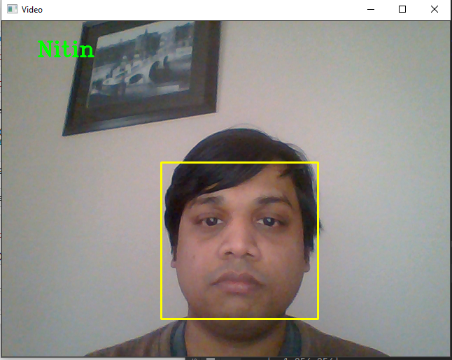
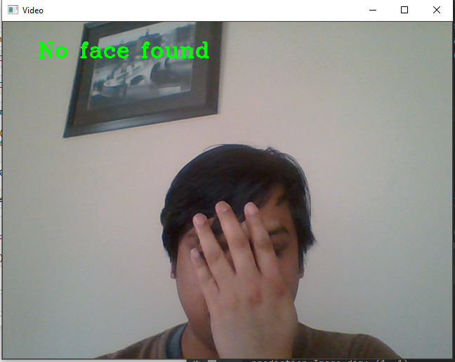

# Face_Recognition-using-Deep Learning and OpenCV

Used VGG model to train the model using the data from Dataset/Train folder and OpenCV to predict the face image capture from webcam.

**Output**

Fig: when captured image matches the dataset

Fig: when no image is found
